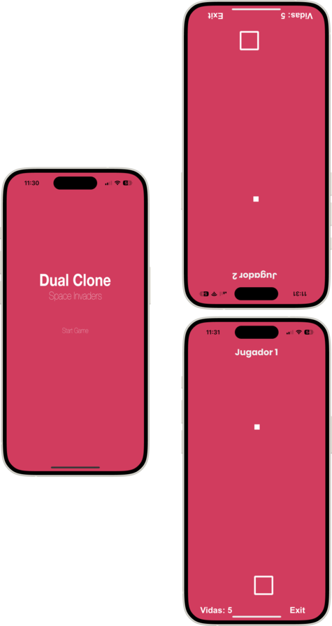

# Proyecto Space Invaders



## Link Video Explicativo App

[Video](https://drive.google.com/file/d/1IOIUs2MWs6fDlU-Q35HeNj_BLhT-wp64/view?usp=sharing)

## Nombre del alumno

Raul Piqueras Melero

## Descripción general del proyecto

El proyecto consiste en la creación de un clon del juego "Dual" con temática de "Space Invaders". El juego se juega en modo multijugador local utilizando Bluetooth para la comunicación entre dispositivos. Los jugadores controlan naves espaciales que pueden moverse y disparar proyectiles. Los disparos que salen de la pantalla de un dispositivo aparecen en la pantalla del otro dispositivo. El objetivo es destruir la nave del oponente mientras se evita ser golpeado por sus disparos.

## Funcionalidades y clases de la aplicación

### MenuScene

`MenuScene` es la escena inicial del juego, que presenta un menú donde los jugadores pueden iniciar el juego. Aquí se configuran las siguientes funcionalidades:

1. **Configuración del fondo:**

   - Se establece un color de fondo consistente con el tema del juego.
2. **Configuración de BLEManager:**

   - Se inicializa el `BLEManager` para gestionar la comunicación Bluetooth.
3. **Título del juego:**

   - Se crea y anima el título "Space Invaders" que se muestra en el centro de la pantalla.
4. **Botón de inicio del juego:**

   - Se crea y anima un botón de "Start Game" que permite a los jugadores comenzar la partida.
5. **Animaciones:**

   - `animateTitle()`: Anima el título del juego con un efecto de escalado.
   - `animateStartGameButton()`: Anima el botón de inicio con un efecto de pulsación.
6. **Detección de toques:**

   - `touchesBegan`: Detecta cuando el usuario toca el botón de "Start Game" y carga la escena del juego (`SpaceInvadersScene`).

#### Código de MenuScene

```swift
import Foundation
import SpriteKit
import CoreBluetooth

class MenuScene: SKScene {
  
    var bleManager: BLEManager!
  
    var scanButton: SKLabelNode!
    var startGameButton: SKLabelNode!
    var titleLabel: SKLabelNode!
  
    override func didMove(to view: SKView) {
        // Configurar el fondo
        self.backgroundColor = SKColor(red: 209/255, green: 60/255, blue: 94/255, alpha: 1.0)
  
        // Configurar BLEManager
        if let appDelegate = UIApplication.shared.delegate as? AppDelegate {
            bleManager = appDelegate.bleManager
        }
  
        // Crear el título del juego
        titleLabel = SKLabelNode(text: "Space Invaders")
        titleLabel.position = CGPoint(x: self.frame.midX, y: self.frame.midY + 100)
        titleLabel.fontSize = 40
        titleLabel.fontColor = SKColor.white
        titleLabel.name = "titleLabel"
        self.addChild(titleLabel)
  
        // Crear el botón para iniciar el juego
        startGameButton = SKLabelNode(text: "Start Game")
        startGameButton.position = CGPoint(x: self.frame.midX, y: self.frame.midY - 50)
        startGameButton.fontSize = 30
        startGameButton.fontColor = SKColor.white
        startGameButton.name = "startGameButton"
        self.addChild(startGameButton)
  
        // Animar el título
        animateTitle()
  
        // Animar el botón de iniciar juego
        animateStartGameButton()
    }
  
    func animateTitle() {
        let scaleUp = SKAction.scale(to: 1.2, duration: 0.5)
        let scaleDown = SKAction.scale(to: 1.0, duration: 0.5)
        let sequence = SKAction.sequence([scaleUp, scaleDown])
        let repeatForever = SKAction.repeatForever(sequence)
        titleLabel.run(repeatForever)
    }
  
    func animateStartGameButton() {
        let pulseUp = SKAction.scale(to: 1.1, duration: 0.6)
        let pulseDown = SKAction.scale(to: 1.0, duration: 0.6)
        let pulseSequence = SKAction.sequence([pulseUp, pulseDown])
        let repeatPulse = SKAction.repeatForever(pulseSequence)
        startGameButton.run(repeatPulse)
    }
  
    override func touchesBegan(_ touches: Set<UITouch>, with event: UIEvent?) {
        for touch in touches {
            let location = touch.location(in: self)
            let touchedNode = self.atPoint(location)
      
            if touchedNode.name == "startGameButton" {
                loadGameScene()
            }
        }
    }
  
    func loadGameScene() {
        if let view = self.view {
            let scene = SpaceInvadersScene(size: view.bounds.size)
            scene.scaleMode = .resizeFill
            let transition = SKTransition.flipHorizontal(withDuration: 0.5)
            view.presentScene(scene, transition: transition)
        }
    }
}

```

## BLEManager

`BLEManager` es la clase responsable de gestionar la comunicación Bluetooth entre los dispositivos. Esta clase maneja tanto la funcionalidad de Central como de Peripheral, permitiendo que los dispositivos se conecten y envíen datos entre sí.

### Inicialización

El inicializador configura el `CBCentralManager` y `CBPeripheralManager` y define los UUIDs para el servicio y la característica utilizada en la comunicación.

```swift
override init() {
    self.myServiceUUID = CBUUID(string: "1201FB7E-AA4B-4D45-9BC7-D527E1F7E784")
    self.myCharacteristicUUID = CBUUID(string: "29E79AF5-2457-40FF-92FE-FE5F299AAED3")
    super.init()
    self.centralManager = CBCentralManager(delegate: self, queue: nil)
    self.peripheralManager = CBPeripheralManager(delegate: self, queue: nil)
}

```

### Escaneo de Periféricos

La función startScanning inicia el escaneo de periféricos que ofrecen el servicio definido.

```swift
func startScanning() {
    if centralManager.state == .poweredOn {
        centralManager.scanForPeripherals(withServices: [myServiceUUID], options: nil)
        print("Started scanning for peripherals")
    } else {
        print("Central Manager is not powered on")
    }
}

```

### Conexión y Descubrimiento de Servicios

Cuando se descubre un periférico, didDiscover lo conecta y descubre sus servicios y características.

```swift
func centralManager(_ central: CBCentralManager, didDiscover peripheral: CBPeripheral, advertisementData: [String : Any], rssi RSSI: NSNumber) {
    discoveredPeripheral = peripheral
    print("Discovered \(peripheral.identifier)")
    peripheral.delegate = self
    centralManager.connect(peripheral, options: nil)
}

func centralManager(_ central: CBCentralManager, didConnect peripheral: CBPeripheral) {
    print("Connected to \(peripheral.identifier)")
    peripheral.discoverServices([myServiceUUID])
}
```

### Lectura y Notificación de Características

Cuando se descubre la característica, el periférico se configura para recibir notificaciones de cambios en su valor.

```swift
func peripheral(_ peripheral: CBPeripheral, didDiscoverCharacteristicsFor service: CBService, error: Error?) {
    if let characteristics = service.characteristics {
        for characteristic in characteristics {
            if characteristic.uuid == myCharacteristicUUID {
                print("Caracteristica descubierta")
                peripheral.readValue(for: characteristic)
                peripheral.setNotifyValue(true, for: characteristic)
                print(peripheral.readValue(for: characteristic))
            }
        }
    }
}
```

### Recepción de Datos

Cuando se recibe un valor actualizado para la característica, se notifica a la aplicación mediante el uso de NotificationCenter.

```swift
func peripheral(_ peripheral: CBPeripheral, didUpdateValueFor characteristic: CBCharacteristic, error: Error?) {
    if let data = characteristic.value {
        print("Received data: \(data)")
        NotificationCenter.default.post(name: .didReceiveProjectileData, object: data)
    }
}
```

### Modo Peripheral y Publicidad

El periférico inicia la publicidad de su servicio y configura la característica para permitir la escritura, lectura y notificación.

```swift
func peripheralManagerDidUpdateState(_ peripheral: CBPeripheralManager) {
    switch peripheral.state {
    case .poweredOn:
        print("Peripheral Manager powered on")
        startAdvertising()
    default:
        print("Peripheral Manager state: \(peripheral.state.rawValue)")
    }
}

func startAdvertising() {
    let advertisementData: [String: Any] = [
        CBAdvertisementDataLocalNameKey: "DualClone",
        CBAdvertisementDataServiceUUIDsKey: [myServiceUUID]
    ]
    peripheralManager.startAdvertising(advertisementData)
  
    myCharacteristic = CBMutableCharacteristic(
        type: myCharacteristicUUID,
        properties: [.write, .notify, .read],
        value: nil,
        permissions: [.writeable, .readable]
    )
  
    let service = CBMutableService(type: myServiceUUID, primary: true)
    service.characteristics = [myCharacteristic]
  
    peripheralManager.add(service)
}
```

### Envío de Datos

Cuando se envían datos, se actualiza el valor de la característica.

```swift
func sendProjectileData(_ data: Data) {
    if myCharacteristic != nil {
        print(peripheralManager.updateValue(data, for: myCharacteristic, onSubscribedCentrals: nil))
        print("Proyectil Enviado Bluetooth")
    }
}
```

### Recepción de Escrituras

El periférico responde a las solicitudes de escritura de datos, notificando a la aplicación cuando se recibe un nuevo valor.

```swift
func peripheralManager(_ peripheral: CBPeripheralManager, didReceiveWrite requests: [CBATTRequest]) {
    for request in requests {
        if request.characteristic.uuid == myCharacteristicUUID {
            if let value = request.value {
                NotificationCenter.default.post(name: .didReceiveProjectileData, object: value)
                peripheralManager.respond(to: request, withResult: .success)
                print("He recibido proyectil")
            }
        }
    }
}
```

### Extensión para Notificaciones

Se define una extensión para Notification.Name para manejar la recepción de datos de proyectiles.

```swift
extension Notification.Name {
    static let didReceiveProjectileData = Notification.Name("didReceiveProjectileData")
}
```

### SpaceInvadersScene

`SpaceInvadersScene` es la escena principal del juego donde ocurre toda la acción. En esta escena, el jugador controla una nave espacial, puede disparar proyectiles y debe evitar los proyectiles del enemigo. La escena también maneja la comunicación Bluetooth para recibir datos de proyectiles del otro dispositivo.

#### Configuración Inicial

En el método `didMove(to:)`, se configuran varios elementos importantes:

- El fondo de la escena.
- La música de fondo.
- La nave del jugador.
- La configuración física del jugador.
- El gestor de movimiento para controlar la nave con el acelerómetro.
- El BLEManager para manejar la comunicación Bluetooth.
- La etiqueta de vidas.
- El botón de salida.

### Movimiento del Jugador

El método updatePlayerPosition(data:) se encarga de actualizar la posición de la nave del jugador utilizando los datos del acelerómetro.

```swift
func updatePlayerPosition(data: CMDeviceMotion) {
    DispatchQueue.main.async {
        let xMovement = CGFloat(data.attitude.roll) * 500
        self.player.position.x += xMovement * CGFloat(self.motionManager.accelerometerUpdateInterval)
    
        // Asegurar que el jugador no se salga de los bordes de la pantalla
        self.player.position.x = max(min(self.player.position.x, self.size.width - self.player.size.width / 2), self.player.size.width / 2)
    }
}
```

### Disparo de Proyectiles

El método shootProjectile() crea y dispara un proyectil desde la posición actual de la nave del jugador.

```swift
func shootProjectile() {
    let projectileSize = CGSize(width: 15, height: 15)
    let projectile = SKSpriteNode(color: SKColor.white, size: projectileSize)
  
    // Posicionar el proyectil centrado pero un poco más adelante del jugador
    projectile.position = CGPoint(x: player.position.x, y: player.position.y + player.size.height / 2 + projectile.size.height)
  
    projectile.physicsBody = SKPhysicsBody(rectangleOf: projectile.size)
    projectile.physicsBody?.isDynamic = true
    projectile.physicsBody?.affectedByGravity = false
    projectile.physicsBody?.categoryBitMask = 2 // Categoría para proyectiles del jugador
    projectile.physicsBody?.contactTestBitMask = 2 // Colisiona con proyectiles enemigos
    projectile.physicsBody?.collisionBitMask = 0
    self.addChild(projectile)
  
    self.run(shootSound)
  
    let moveAction = SKAction.moveBy(x: 0, y: self.frame.height, duration: 1.0)
    let removeAction = SKAction.run {
        // Invertir la coordenada x para el dispositivo receptor
        let invertedX = self.frame.width - projectile.position.x
        if let projectileData = try? JSONEncoder().encode(["x": invertedX, "y": projectile.position.y]) {
            self.bleManager.sendProjectileData(projectileData)
        }
        projectile.removeFromParent()
    }
    projectile.run(SKAction.sequence([moveAction, removeAction]))
}
```

### Recepción de Proyectiles

El método receivedProjectileData(_:) recibe los datos de los proyectiles enviados por el otro dispositivo y los crea en la escena.

```swift
@objc func receivedProjectileData(_ notification: Notification) {
    if let data = notification.object as? Data {
        if let projectileInfo = try? JSONDecoder().decode([String: CGFloat].self, from: data) {
            let projectileSize = CGSize(width: 15, height: 15)
            let projectile = SKSpriteNode(color: SKColor(red: 78/255, green: 169/255, blue: 87/255, alpha: 1.0), size: projectileSize)
            projectile.position = CGPoint(x: projectileInfo["x"]!, y: self.frame.maxY)
            projectile.physicsBody = SKPhysicsBody(rectangleOf: projectile.size)
            projectile.physicsBody?.isDynamic = true
            projectile.physicsBody?.affectedByGravity = false
            projectile.physicsBody?.categoryBitMask = 2 // Categoría para proyectiles del enemigo
            projectile.physicsBody?.contactTestBitMask = 1 | 2 // Colisiona con el jugador y con proyectiles del jugador
            projectile.physicsBody?.collisionBitMask = 0
            self.addChild(projectile)
        
            let moveAction = SKAction.moveBy(x: 0, y: -self.frame.height, duration: 1.0)
            let removeAction = SKAction.removeFromParent()
            projectile.run(SKAction.sequence([moveAction, removeAction]))
        }
    }
}
```

### Manejo de Colisiones

El método didBegin(_:) maneja las colisiones entre los proyectiles y la nave del jugador o entre dos proyectiles.

```swift
func didBegin(_ contact: SKPhysicsContact) {
    var firstBody: SKPhysicsBody
    var secondBody: SKPhysicsBody
  
    if contact.bodyA.categoryBitMask < contact.bodyB.categoryBitMask {
        firstBody = contact.bodyA
        secondBody = contact.bodyB
    } else {
        firstBody = contact.bodyB
        secondBody = contact.bodyA
    }
  
    if firstBody.categoryBitMask == 1 && secondBody.categoryBitMask == 2 {
        if firstBody.node is SKSpriteNode {
            handlePlayerHit()
            createExplosion(at: contact.contactPoint)
        }
        secondBody.node?.removeFromParent()
    } else if firstBody.categoryBitMask == 2 && secondBody.categoryBitMask == 2 {
        // Proyectil del jugador colisiona con proyectil enemigo
        createExplosion(at: contact.contactPoint)
        self.run(proyectile)
        firstBody.node?.removeFromParent()
        secondBody.node?.removeFromParent()
    }
}
```

### Creación de Explosiones

El método createExplosion(at:) crea una animación de explosión en la posición de la colisión.

```swift
func createExplosion(at position: CGPoint) {
    if let explosion = SKEmitterNode(fileNamed: "Explosion.sks") {
        explosion.position = position
        self.addChild(explosion)
    
        let fadeOutAction = SKAction.fadeOut(withDuration: 0.3) // Desvanece el emisor de partículas
        let removeAction = SKAction.removeFromParent()
        let sequenceAction = SKAction.sequence([fadeOutAction, removeAction])
        explosion.run(sequenceAction)
    }
}
```

### Manejo de Vidas y Game Over

El método handlePlayerHit() reduce las vidas del jugador y maneja la lógica de game over. El método gameOver() muestra un mensaje de "Game Over" y regresa al menú después de 3 segundos.

```swift
func handlePlayerHit() {
    lives -= 1
    livesLabel.text = "Vidas: \(lives)"
  
    // Reproducir sonido de invaderkilled
    self.run(invaderKilled)
  
    if lives <= 0 {
        gameOver()
    }
}

func gameOver() {
    // Crear el nodo de texto "Game Over"
    let gameOverLabel = SKLabelNode(text: "Game Over")
    gameOverLabel.fontName = "Arial-BoldMT"
    gameOverLabel.fontSize = 48
    gameOverLabel.fontColor = .white
    gameOverLabel.position = CGPoint(x: self.frame.midX, y: self.frame.midY)
    gameOverLabel.zPosition = 100 // Asegurarse de que el texto esté al frente
    self.addChild(gameOverLabel)
  
    // Esperar 3 segundos y luego volver al menú
    let waitAction = SKAction.wait(forDuration: 3.0)
    let transitionAction = SKAction.run {
        let transition = SKTransition.flipHorizontal(withDuration: 0.5)
        if let scene = MenuScene(fileNamed: "MenuScene") {
            scene.scaleMode = .fill
            self.view?.presentScene(scene, transition: transition)
        }
    }
    let sequence = SKAction.sequence([waitAction, transitionAction])
    self.run(sequence)
}
```

### Botón de Salida

El método returnToMenu() muestra un diálogo de confirmación antes de regresar al menú.

```swift
func returnToMenu() {
    if let view = self.view, let viewController = view.window?.rootViewController {
        let alert = UIAlertController(title: "Confirm Exit", message: "Are you sure you want to return to the menu?", preferredStyle: .alert)
    
        let confirmAction = UIAlertAction(title: "Yes", style: .default) { _ in
            let transition = SKTransition.flipHorizontal(withDuration: 0.5)
            if let scene = MenuScene(fileNamed: "MenuScene") {
                scene.scaleMode = .fill
                view.presentScene(scene, transition: transition)
            }
        }
    
        let cancelAction = UIAlertAction(title: "No", style: .cancel, handler: nil)
    
        alert.addAction(confirmAction)
        alert.addAction(cancelAction)
    
        viewController.present(alert, animated: true, completion: nil)
    }
}
```
